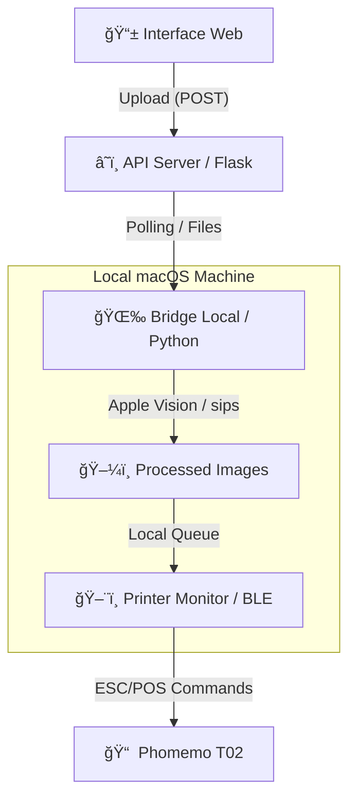

# Barzar Web: Cigarros Grátis Aqui
Barzar foi um encontro de arte, brechó e bebedeira. Também foi o vernissage do meu domínio. Para botar esse endereço web que acabei de adquirir para uso, decidi continuar um [projeto de engenharia reversa de uma impressora térmica Phomemo T02](https://github.com/matheusdanoite/Phomemo-T02-Driver-for-macOS). A ideia era permitir interações entre o digital e o físico, não sobrecarregar o usuário com conteúdo inútil, respeitar sua privacidade e também beber umas cervejas. O sistema permite que usuários enviem fotos e mensagens de uma interface web para serem processadas com filtros inteligentes via Apple Vision e impressas automaticamente na Phomemto T02 via Bluetooth.

## Como Funciona
Ao entrar no saity do Barzar, o usuário é recebido com duas escolhas: "Cigarros grátis", ou "Sou contra". 

A primeira escolha leva a uma visualização da câmera, que, uma vez capturada uma foto, é encaminhada via túnel da Cloudflare para o meu Mac, que faz o processamento via Apple Vision para detecção de faces, a inversão do arquivo de imagem de cigarro aplicado para otimizar o contraste com o fundo, envio dessas informações para a impressora e subsequente destruição de todos os arquivos processados.
Já na segunda escolha, o usuário tem a possibilidade de escrever um texto defendendo seu ponto de vista antitabagista, ou escrever o que lhe der na telha, dentro dos limites de 280 caracteres. O texto não passa pelo Vision Framework, mas tem um pipeline próprio que adapta o tamanho da fonte de acordo com o tamanho do conteúdo para melhor caber em uma dada área dentro de um arquivo de imagem para servir de moldura.
Ambos os modos possuem feedback de status em tempo real, informando o usuário de que passo está sendo realiado e com "Me perdi aqui" como mensagem de erro.

## Funcionalidades Principais
- **Captura Web**: Interface responsiva, otimizada para dispositivos mobile, capturando fotos e mensagens de texto.
- **Apple Vision Overlays**: Detecção de landmarks faciais para aplicação automática de óculos, cigarros, brilhos e molduras.
- **Contraste Inteligente**: Inversão automática das cores dos overlays baseada no brilho da imagem de fundo para garantir visibilidade, visto que a Phomemo T02 imprime em escala de cinza com uma resolução baixíssima.
- **Thermal Printing**: Driver customizado para Phomemo T02 (disponível aqui no meu GitHub!) com suporte a imagens e textos.
- **Modo Telepatia**: Sincronização em tempo real do status da impressão (Mandando -> Telepatia feita -> Olhe a impressora -> Pronto).
=======
- **Captura Instantânea**: Interface mobile-first desenvolvida com **Vite** para captura rápida de fotos e mensagens.
- **Apple Vision Overlays**: Processamento inteligente via macOS para detecção de faces e aplicação automática de acessórios (óculos, cigarros, brilhos).
- **Contraste Adaptativo**: Inversão automática das cores dos overlays baseada na luminosidade da foto, garantindo visibilidade na impressão térmica de 203 DPI.
- **Modo Telepatia**: Sincronização em tempo real do status: *Enviando -> Processando -> Olhe para a Impressora -> Concluído*.
- **Driver Customizado**: Integração direta com a Phomemo T02 via comandos ESC/POS via BLE.

## Arquitetura do Sistema
O projeto utiliza uma estrutura distribuída para contornar limitações de hardware e conectividade:


## Stack Tecnológico
| Camada | Tecnologias |
| :--- | :--- |
| **Frontend** | HTML5, CSS3 (Vanilla), JavaScript, [Vite](https://vitejs.dev/) |
| **Backend** | Python, Flask, Flask-CORS |
| **Processing** | Apple Vision Framework, `pyobjc`, Pillow, `sips` |
| **Hardware/Comm** | Bluetooth LE, [Bleak](https://github.com/hbldh/bleak), Cloudflare Tunnels |

## Como Instalar e Rodar
### Pré-requisitos
- **macOS** (Obrigatório para Vision Framework e `sips`).
- **Python 3.10+**
- **Node.js 18+** (para o Frontend)
- **Bluetooth** habilitado.

### Configuração
1. **Clone o repositório**:
   ```bash
   git clone https://github.com/matheusdanoite/barzar-web.git
   cd barzar-web
   ```

2. **Ambiente Python**:
   ```bash
   python3 -m venv venv
   source venv/bin/activate
   pip install -r requirements.txt
   # Ou instale manualmente: 
   # pip install flask flask-cors requests bleak Pillow pyobjc-framework-Vision pyobjc-framework-Quartz python-dotenv
   ```

3. **Ambiente Frontend**:
   ```bash
   npm install
   ```

4. **Variáveis de Ambiente**:
   Crie um arquivo `.env` baseado no `.env.example`:
   ```bash
   cp .env.example .env
   # Configure o REMOTE_SERVER_URL com seu túnel ou IP local
   ```

### Execução
Para facilitar, você pode usar o script de automação:
```bash
chmod +x start_barzar.sh
./start_barzar.sh
```
*Este script abrirá 4 terminais: Server, Tunnel, Printer Monitor e Bridge.*

Para rodar o **Frontend** em modo desenvolvimento:
```bash
npm run dev
```

## Dicas de Hardware (Phomemo T02)
- Certifique-se que a impressora está ligada e com carga.
- O sistema busca automaticamente o dispositivo via BLE. Se houver falha na conexão, verifique se nenhum outro app (como o oficial da Phomemo) está utilizando o Bluetooth.

## Créditos e Contribuições
- **Design & Arte**: Ana e Natan
- **Desenvolvimento**: [matheusdanoite](https://github.com/matheusdanoite).

> [!NOTE]
> Este projeto foi desenvolvido por puros fins artísticos e experimentais.
> **Corporação matheusdanoite © 2026**
