# Barzar Web: Free Cigarettes

[Português Brasileiro](README.pt-br.md)

Barzar was an art, thrift shop, and drinking gathering. It was also the vernissage of my domain. To put this web address I just acquired to use, I decided to continue a [reverse engineering project of a Phomemo T02 thermal printer](https://github.com/matheusdanoite/Phomemo-T02-Driver-for-macOS). The idea was to allow interactions between the digital and the physical, not overload the user with useless content, respect their privacy, and also drink some beers. The system allows users to send photos and messages from a web interface to be processed with smart filters via Apple Vision and automatically printed on the Phomemo T02 via Bluetooth.

## How It Works
Upon entering the Barzar website, the user is greeted with two choices: "Free Cigarettes", or "I'm within't".

The first choice leads to a camera view, which, once a photo is captured, is forwarded via a Cloudflare tunnel to my Mac. There, it undergoes processing via Apple Vision for face detection, inversion of the applied cigarette image overlay to optimize contrast with the background, sending on of this data to the printer, and subsequent destruction of all processed files.

In the second choice, the user has the possibility to write a text defending their anti-smoking viewpoint, or write whatever they feel like, within the limits of 280 characters. The text does not go through the Vision Framework but has its own pipeline that adapts the font size according to the content length to better fit within a given area inside an image file acting as a frame.

Both modes have real-time status feedback, informing the user which step is currently being performed and using "I got lost here" as an error message.

## Key Features
- **Web Capture**: Responsive interface, optimized for mobile devices, capturing photos and text messages.
- **Apple Vision Overlays**: Facial landmark detection for automatic application of cigarettes and frames.
- **Smart Contrast**: Automatic inversion of overlay colors based on the brightness of the background image to ensure visibility, given that the Phomemo T02 prints in grayscale with very low resolution.
- **Text Sizing**: Automatic text sizing to optimize the occupation of the printable area.
- **Thermal Printing**: Custom driver for Phomemo T02 [(available here on my GitHub!)](https://github.com/matheusdanoite/Phomemo-T02-Driver-for-macOS) with support for images and text.
- **Telepathy Mode**: Real-time synchronization of print status (Sending -> Telepathy done -> Look at the printer -> Ready).

## System Architecture
The project uses a distributed structure to circumvent hardware and connectivity limitations:

```mermaid
graph TD
    A[📱 Web Interface] -- "Upload (POST)" --> B[☁️ API Server / Flask]
    B -- "Polling / Files" --> C[🌉 Local Bridge / Python]
    C -- "Apple Vision / sips" --> D[🖼️ Processed Images]
    D -- "Local Queue" --> E[🖨️ Printer Monitor / BLE]
    E -- "ESC/POS Commands" --> F[📠 Phomemo T02]
    
    subgraph "Local macOS Machine"
    C
    D
    E
    end
```


## Tech Stack
| Layer | Technologies |
| :--- | :--- |
| **Frontend** | HTML5, CSS3 (Vanilla), JavaScript, [Vite](https://vitejs.dev/) |
| **Backend** | Python, Flask, Flask-CORS |
| **Processing** | Apple Vision Framework, `pyobjc`, Pillow, `sips` |
| **Hardware/Comm** | Bluetooth LE, [Bleak](https://github.com/hbldh/bleak), Cloudflare Tunnels |

## How to Install and Run
### Prerequisites
- **macOS** (Required for Vision Framework and `sips`).
- **Python 3.10+**
- **Node.js 18+** (for the Frontend)
- **Bluetooth** enabled.

### Configuration
1. **Clone the repository**:
   ```bash
   git clone https://github.com/matheusdanoite/barzar-web.git
   cd barzar-web
   ```

2. **Python Environment**:
   ```bash
   python3 -m venv venv
   source venv/bin/activate
   pip install -r requirements.txt
   ```
   
   Or install manually: 
   ```bash
   pip install flask flask-cors requests bleak Pillow pyobjc-framework-Vision pyobjc-framework-Quartz python-dotenv
   ```

3. **Frontend Environment**:
   ```bash
   npm install
   ```

4. **API Configuration**:
    It is necessary to point the frontend to the correct API URL.
    - Open the file [app.js](https://github.com/matheusdanoite/Cigarros-Gratis/blob/main/barzar/app.js).
    - Locate line 54 and replace the URL in `const API_BASE_URL` with your tunnel URL or local IP.

### Execution
To make it easier, you can use the automation script:
```bash
chmod +x start_barzar.sh
./start_barzar.sh
```
*This script will open 4 terminals: Server, Tunnel, Printer Monitor, and Bridge.*

To run the **Frontend** in development mode:
```bash
npm run dev
```

## Hardware Tips (Phomemo T02)
- Ensure the printer is turned on and charged.
- The system automatically searches for the device via BLE. If the connection fails, check if no other app (like the official Phomemo app) is using Bluetooth.

## Credits and Contributions
- **Design & Art**: Ana and Natan
- **Development**: [matheusdanoite](https://github.com/matheusdanoite).

> [!NOTE]
> This project was developed for purely artistic and experimental purposes.

**matheusdanoite Corp © 2026**
